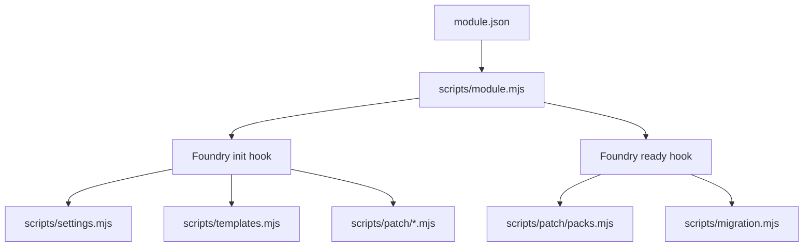

# Developer Guide

This guide is for contributors working directly in the `sw5e-module` repository. It explains where the important parts of the module live, how local changes flow into Foundry, and which files matter most when you need to debug or extend the project.

If you need a simpler setup-first walkthrough, start with [Local Setup And Workflow](./local-setup.md). This document is the more technical companion for developers.

## Project Purpose

`sw5e-module` is a Foundry VTT module that layers SW5E content and behavior on top of the `dnd5e` system.

Current project targets:

- Foundry VTT `13.351`
- `dnd5e` `5.2.5`
- `lib-wrapper` enabled

The main manifest is [`module.json`](../module.json). It defines module metadata, the entry script, loaded styles, languages, and the full compendium registry.

## Repo Map

The repository is split between runtime code, UI assets, and compendium source data.

| Path | Purpose |
| --- | --- |
| [`module.json`](../module.json) | Foundry manifest, pack registry, compatibility metadata, entry script, and loaded styles/languages |
| [`scripts/module.mjs`](../scripts/module.mjs) | Main runtime bootstrap; registers settings, preloads templates, applies patches, and runs migrations |
| [`scripts/patch/`](../scripts/patch/) | Runtime compatibility and behavior patches for `dnd5e` and module features |
| [`scripts/templates.mjs`](../scripts/templates.mjs) | Registers and preloads Handlebars partials |
| [`scripts/settings.mjs`](../scripts/settings.mjs) | Module setting registration |
| [`scripts/migration.mjs`](../scripts/migration.mjs) | World migration entrypoints used on `ready` |
| [`applications/`](../applications/) | Standalone custom application code |
| [`templates/`](../templates/) | Handlebars templates and sheet fragments |
| [`styles/`](../styles/) | Module CSS |
| [`languages/`](../languages/) | Localization files |
| [`icons/`](../icons/) | Pack and UI art assets |
| [`packs/_source/`](../packs/_source/) | Editable compendium JSON source files |
| [`packs/`](../packs/) | Generated Foundry compendium databases; do not edit by hand |
| [`utils/packs.mjs`](../utils/packs.mjs) | Pack build, clean, and unpack pipeline |
| [`.github/workflows/main.yml`](../.github/workflows/main.yml) | Release packaging workflow |
| [`README.md`](../README.md) | User-facing overview plus basic local dev notes |
| [`docs/local-setup.md`](./local-setup.md) | Setup and troubleshooting walkthrough for routine local work |

## Runtime Architecture

At runtime, the module is loaded directly from source files. There is no frontend bundler in this repo.

The most important runtime entrypoint is [`scripts/module.mjs`](../scripts/module.mjs). In broad terms it does the following:

- On `init`, registers settings, registers `lib-wrapper` hooks, preloads templates, and applies the module's runtime patches.
- On `ready`, patches pack behavior, finishes proficiency setup, and runs world migrations if needed.

The patch layer in [`scripts/patch/`](../scripts/patch/) is where most feature work lands. Current patch files include areas such as:

- `addHooks.mjs` for wrapper and hook registration
- `config.mjs` and `dataModels.mjs` for `dnd5e` config/model changes
- `maneuver.mjs`, `powercasting.mjs`, `medpac.mjs`, and `blaster-reload.mjs` for feature-specific behavior
- `starship-prepare.mjs` and `starship-sheet.mjs` for starship-specific behavior and UI integration
- `packs.mjs` and `proficiency.mjs` for post-load pack and proficiency behavior

## UI And Template Layer

If a change is visible on a sheet, item form, or custom dialog, you will usually be working in one or more of these locations:

- [`applications/checkbox-select.mjs`](../applications/checkbox-select.mjs) for the custom checkbox selection app
- [`templates/checkbox-select.hbs`](../templates/checkbox-select.hbs) for that app's markup
- [`templates/items/details/details-maneuver.hbs`](../templates/items/details/details-maneuver.hbs) and related maneuver templates for maneuver-specific item sheet UI
- [`templates/starship-sheet-layer.hbs`](../templates/starship-sheet-layer.hbs), [`templates/starship-features-layer.hbs`](../templates/starship-features-layer.hbs), and [`templates/starship-sidebar-summary.hbs`](../templates/starship-sidebar-summary.hbs) for starship sheet extensions
- [`templates/powercasting-sheet-tracker.hbs`](../templates/powercasting-sheet-tracker.hbs) for powercasting UI
- [`styles/module.css`](../styles/module.css) for module styling

For template-related debugging, also check [`scripts/templates.mjs`](../scripts/templates.mjs), which preloads the partials used by the module.

## Compendium Source Of Truth

The most important repo rule is:

- edit `packs/_source/`
- build into `packs/`

[`packs/_source/`](../packs/_source/) contains editable JSON source files. [`packs/`](../packs/) contains generated LevelDB compendium data used by Foundry. The generated `packs/` directory is intentionally ignored by git, except for the source subtree.

Do not hand-edit files under `packs/`. If you change compendium content and do not rebuild, Foundry will continue using stale generated data.

## Build And Data Pipeline

The build process in this repo is mostly about compendium packaging, not asset bundling.

Available npm scripts from [`package.json`](../package.json):

- `npm install`
  Installs dependencies and automatically runs `npm run build:db` afterward.
- `npm run build`
  Alias for `npm run build:db`.
- `npm run build:db`
  Compiles `packs/_source/` JSON into Foundry-ready compendia in `packs/`.
- `npm run build:json`
  Extracts built compendia back into JSON under `packs/_source/`.
- `npm run build:clean`
  Cleans and normalizes source pack data.

Targeted commands are also supported:

- `npm run build:db -- classes`
- `npm run build:json -- classes Barbarian`
- `npm run build:clean -- classes Barbarian`

The implementation lives in [`utils/packs.mjs`](../utils/packs.mjs). That script:

- parses the `package [action] [pack] [entry]` CLI
- cleans and normalizes source data before writing output
- converts legacy SW5E data shapes into current `dnd5e`-compatible forms
- compiles JSON into ClassicLevel databases under `packs/`
- extracts built pack data back into JSON when needed

## Common Change Routing

Use this as a quick "where should I start?" reference.

| If you need to change... | Start here |
| --- | --- |
| Compendium entry data | [`packs/_source/`](../packs/_source/) |
| A `dnd5e` behavior patch or system integration | [`scripts/patch/`](../scripts/patch/) |
| Module startup flow | [`scripts/module.mjs`](../scripts/module.mjs) |
| Template preloading | [`scripts/templates.mjs`](../scripts/templates.mjs) |
| Module settings | [`scripts/settings.mjs`](../scripts/settings.mjs) |
| Custom dialog/application behavior | [`applications/`](../applications/) |
| Sheet layout or injected markup | [`templates/`](../templates/) |
| CSS styling | [`styles/`](../styles/) |
| Localization text | [`languages/`](../languages/) |
| Asset paths or icons | [`icons/`](../icons/) |
| Pack build behavior | [`utils/packs.mjs`](../utils/packs.mjs) |
| Release packaging | [`.github/workflows/main.yml`](../.github/workflows/main.yml) |

## Typical Developer Workflows

### Code, Template, Style, Or Localization Change

1. Edit the relevant file in `scripts/`, `applications/`, `templates/`, `styles/`, or `languages/`.
2. Reload Foundry.
3. Re-test the affected feature.

You usually do not need `npm run build:db` for code-only or template-only work.

### Compendium Content Change

1. Edit the relevant file in `packs/_source/`.
2. Run `npm run build:db`.
3. Reload Foundry.
4. Open the affected compendium entry in a test world and verify the result.

### Pack Data Cleanup Or Inspection

Use `npm run build:clean` when you want to normalize pack source data, or `npm run build:json` when you need to re-extract built pack content into JSON form.

## Release Process

Release packaging is handled by [`.github/workflows/main.yml`](../.github/workflows/main.yml) and runs when a GitHub release is published.

At a high level, the workflow:

1. checks out the repository
2. extracts the version from the release tag
3. replaces placeholder values in [`module.json`](../module.json)
4. runs `npm ci`
5. runs `npm run build:db`
6. creates `module.zip`
7. uploads `module.json` and `module.zip` to the release

The release archive includes:

- `module.json`
- `README.md`
- `LICENSE`
- `applications/`
- `icons/`
- `languages/`
- `packs/`
- `scripts/`
- `styles/`
- `templates/`

The editable `packs/_source/` files are excluded from the release archive. Release artifacts ship built pack data, not the raw authoring source.

## Project-Specific Conventions And Gotchas

- There is no app bundler to rebuild after JS or CSS edits. Foundry loads the runtime files declared in [`module.json`](../module.json) directly.
- `packs/` is generated output. Treat `packs/_source/` as the source of truth.
- `lib-wrapper` is required for the module's patch layer to behave correctly in the expected test setup.
- The sibling `sw5e` repository is reference material for older compatibility work. For this project, make changes in `sw5e-module` unless you intentionally start a different task.
- If a change seems to affect sheet rendering, inspect both the relevant patch file and the matching template/CSS files. Many visible behaviors cross those boundaries.

## Suggested Reading Order

For a fast orientation, read these files in order:

1. [`README.md`](../README.md)
2. [`docs/local-setup.md`](./local-setup.md)
3. [`module.json`](../module.json)
4. [`scripts/module.mjs`](../scripts/module.mjs)
5. [`utils/packs.mjs`](../utils/packs.mjs)

That sequence gives you the quickest overview of what the module is, how it loads, and how content is built.
