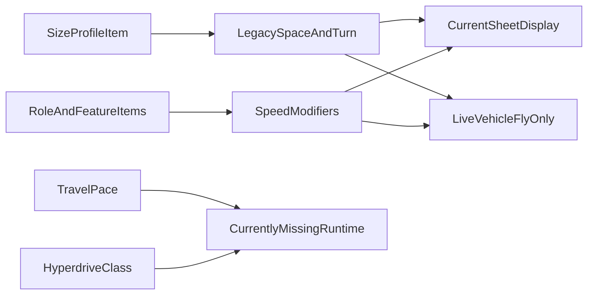

# Starship Speed Review

This document compares the current `sw5e-module` vehicle-backed starship speed model against the movement rules in `Starships of the Galaxy`.

## Rules Baseline

From `Starships of the Galaxy`, starship movement is built around four distinct concepts:

- `flying speed`: the movement budget spent to move in tactical realspace
- `turning speed`: the movement cost to rotate 90 degrees
- `travel pace`: fast / normal / slow travel outside close tactical movement
- `hyperdrive class`: separate hyperspace travel speed, not derived from tactical movement

The published SW5E rules make `flying speed` and `turning speed` separate values. They are not meant to be collapsed into a single generic vehicle speed field.

## What The Module Currently Stores

The module still preserves part of the legacy SW5E speed model in migrated starship data.

In [`scripts/starship-data.mjs`](../scripts/starship-data.mjs), migrated legacy movement is preserved under `legacyStarshipActor.system.attributes.movement`:

```javascript
// scripts/starship-data.mjs
legacyAttributes.movement.space = toFiniteNumber(
	currentAttributes.movement?.fly ?? currentAttributes.speed?.space,
	toFiniteNumber(legacyAttributes.movement.space, 0)
) ?? 0;
legacyAttributes.movement.units = currentAttributes.movement?.units ?? legacyAttributes.movement.units ?? "ft";
legacyAttributes.movement.turn = toFiniteNumber(legacyAttributes.movement.turn, 0) ?? 0;
```

But the live converted `vehicle` actor only gets a flattened `fly` field:

```javascript
// scripts/starship-data.mjs
attributes: {
	movement: {
		fly: flySpeed,
		units: existingSystem.attributes?.movement?.units ?? "ft",
		hover: existingSystem.attributes?.movement?.hover ?? true
	}
}
```

That means:

- `space` is preserved in legacy actor flags
- `turn` is preserved in legacy actor flags
- only `fly` is projected into the live `dnd5e` vehicle actor

## What The Source Packs Already Contain

The pack sources retain the original size-based base speed data directly.

Examples from [`packs/_source/starships/tiny-starship.json`](../packs/_source/starships/tiny-starship.json) and [`packs/_source/starships/medium-starship.json`](../packs/_source/starships/medium-starship.json):

```json
"baseSpaceSpeed": 300,
"baseTurnSpeed": 300
```

```json
"baseSpaceSpeed": 300,
"baseTurnSpeed": 200
```

Across the size profiles, the current pack data matches the published size baselines:

- Tiny: `300 / 300`
- Small: `300 / 250`
- Medium: `300 / 200`
- Large: `300 / 150`
- Huge: `300 / 100`
- Gargantuan: `300 / 50`

The pack data also retains fuel-related travel resources:

- `fuelCost`
- `fuelCap`

## Role And Feature Data

Some starship feature items still carry movement-related fields or textual speed modifiers.

Example from [`packs/_source/starshipfeatures/role-courier.json`](../packs/_source/starshipfeatures/role-courier.json):

```json
"attributes": {
  "speed": {
    "space": 300,
    "turn": 150
  }
}
```

Example from [`packs/_source/starshipfeatures/evasive-maneuvers.json`](../packs/_source/starshipfeatures/evasive-maneuvers.json):

```json
"description": {
  "value": "... The ship then gains that many feet that it can move or spend to turn ..."
}
```

This shows two things:

- some role items still carry explicit `space` / `turn` values
- other movement modifiers are only represented in text and are not currently executed as mechanics

## What The Current Sheet Shows

The current starship sheet already knows about both movement numbers, but only as display values from legacy data.

In [`scripts/patch/starship-sheet.mjs`](../scripts/patch/starship-sheet.mjs):

```javascript
function formatMovement(actor, legacySystem) {
	const legacyMovement = legacySystem.attributes?.movement ?? {};
	const space = Number.isFinite(Number(legacyMovement.space)) ? Number(legacyMovement.space) : null;
	const turn = Number.isFinite(Number(legacyMovement.turn)) ? Number(legacyMovement.turn) : null;
	if ( space != null || turn != null ) {
		return {
			primary: `${space ?? 0} ${units}`,
			secondary: turn != null ? `Turn ${turn}` : ""
		};
	}
```

So the sheet already displays:

- primary movement: `space`
- secondary movement note: `turn`

But this is presentational only. The underlying live vehicle actor still only has `attributes.movement.fly`.

## Missing Or Flattened Concepts

Compared to the SW5E rules baseline, the current vehicle-backed implementation is missing or flattening several important concepts.

### 1. Turning speed is not a first-class live field

It exists in legacy data and on the custom sheet, but not in the live `dnd5e` vehicle actor model.

### 2. Travel pace is not modeled

I did not find a dedicated field or runtime for:

- fast pace
- normal pace
- slow pace

There are text references in content such as [`packs/_source/ventures/space-explorer.json`](../packs/_source/ventures/space-explorer.json), but not a live sheet/runtime concept.

### 3. Hyperdrive class is not modeled

I did not find an obvious dedicated field for:

- hyperdrive class
- hyperspace travel speed

Current starship data carries fuel, but not a surfaced hyperdrive travel stat.

### 4. Speed modifiers are only partially mechanical

The source material includes:

- base size speed
- role speed profiles
- deployment and feature movement modifiers
- power-routing engine effects

Right now, only part of that is reflected in live actor movement, and the rest is either flattened into one `fly` number or left in descriptive text.

## Current State Summary

The current module is in a middle state:

- the source packs and legacy flags still know about SW5E-style `space` and `turn`
- the custom starship sheet can display those values
- the actual live `vehicle` actor mostly reduces movement to one `fly` speed
- travel pace and hyperdrive class are not yet represented as first-class runtime concepts

## Recommended Alignment Direction

The safest next implementation pass is to keep the current vehicle-backed architecture, but restore speed as a structured starship runtime model.

Recommended order:

1. Make `flying speed` and `turning speed` first-class derived starship runtime values.
2. Keep projecting `flying speed` into the vehicle actor's `movement.fly` for compatibility.
3. Preserve `turning speed` in module-owned runtime data and surface it consistently on the sheet.
4. Add explicit starship-only fields for `travel pace` and `hyperdrive class`.
5. Decide which speed modifiers should become live mechanics now versus stay informational for a later pass.

## Practical Next Plan

The next focused implementation plan should answer:

- where to derive final `flying speed`
- where to derive final `turning speed`
- whether role/classification items should override or modify base size movement
- where `travel pace` should live in actor data
- where `hyperdrive class` should live in actor data
- which parts belong on the sidebar, bridge cards, or a future travel panel

## Comparison Flow


